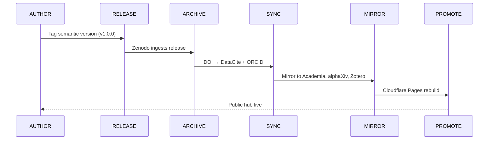

<div align="center">


<br/>


<br/>


<br/>

<a href="https://deontewatts.space"></a>
<a href="https://orcid.org/0009-0005-8586-3650"></a>


<br/>


</div>

---

## About

**Deonte Watts** · Independent Researcher

A public research identity hub for manuscripts, citation records, DOI releases, authority profiles, and open-science publishing workflows. Architecting justice engines through code and community-centered design.

> **ORCID:** [0009-0005-8586-3650](https://orcid.org/0009-0005-8586-3650)
> **Website:** [deontewatts.space](https://deontewatts.space)

---

## Network Nodes

| Platform | Role | Link |
|:---:|---|---|
|  | **Canonical Hub** | [DeonteWatts.Space](https://deontewatts.space) |
|  | **Research Identifier** | [ORCID](https://orcid.org/0009-0005-8586-3650) |
|  | **Code Source** | [GitHub](https://github.com/DeontewattsV1) |
|  | **DOI Archive** | [Zenodo](https://zenodo.org/deontewatts) |
|  | **Research Mirror** | [Academia.edu](https://deontewatts.academia.edu) |
|  | **Standards Profile** | [FAIRsharing](https://fairsharing.org/users/17334) |

---

## Archival Protocol

| Step | Protocol | Function |
|---:|---|---|
| 01 | **AUTHOR** | Write in manuscript/main.tex and keep bibliography in bibliography/references.bib. |
| 02 | **RELEASE** | Create a GitHub release with a semantic version tag such as v1.0.0. |
| 03 | **ARCHIVE** | Zenodo ingests the enabled GitHub release and creates a DOI. |
| 04 | **SYNC** | DataCite receives DOI metadata with ORCID creator metadata. |
| 05 | **MIRROR** | Mirror DOI links to Academia.edu, alphaXiv, Zotero, and profile pages. |
| 06 | **PROMOTE** | Cloudflare Pages rebuilds the public research hub from GitHub. |

### Archival Workflow Sequence



---

<details>
<summary><strong>Run the Research Hub App</strong></summary>

<br/>

```bash
npm install
npm run dev
npm run build
```

Cloudflare Pages build settings:

```txt
Build command: npm run build
Build output directory: dist
```

</details>

---

<details>
<summary><strong>Repository Map</strong></summary>

<br/>

```txt
assets/readme-hero.svg        README visual front-page header
README.config.json            Editable content/theme/profile config
scripts/generate-readme.mjs   README + SVG renderer
src/                          Vite/React public research hub app
data/                         Profile, publications, and workflow data
metadata/                     DOI, ORCID, Dublin Core, and DataCite records
manuscript/                   LaTeX manuscript sources
bibliography/                 BibTeX, RIS, and CSL citation records
```

</details>

---

## Configure This README Front Page

Edit `README.config.json`, then regenerate the front page:

```bash
npm run readme:build
```

The generated README uses GitHub-safe Markdown plus an animated SVG image.

---

## Citation

See `CITATION.cff` and `.zenodo.json`.

```bibtex
@misc{watts2026architects_signal,
  author       = {Watts, Deonte},
  title        = {The Architect's Signal: Open Science Infrastructure},
  year         = {2026},
  publisher    = {GitHub / Zenodo},
  url          = {https://github.com/DeontewattsV1/The-Architects-Signal},
  note         = {ORCID: 0009-0005-8586-3650}
}
```

---

## Quick Stats

<div align="center">


<br/>


</div>

---

## Related Projects

<div align="center">

<a href="https://github.com/DeontewattsV1/Git-Locker-"></a>
<a href="https://github.com/DeontewattsV1/Harmonic-Visual-Environment-Journal-and-HIMM"></a>
<a href="https://github.com/DeontewattsV1/Wildfire-The-Architecture-of-Surrender"></a>

</div>

---

<details>
<summary><strong>Support This Project</strong></summary>

<br/>

<div align="center">

[](https://www.patreon.com/cw/GetitD)
[](https://opencollective.com/deontewattsv1)
[](https://ko-fi.com/deontewattsv1)
[](https://sonarcloud.io/organizations/deontewattsv1/)
[](https://crowdfunding.lfx.linuxfoundation.org/deontewattssV1)
[](https://liberapay.com/DeontewattsV1/)
[](https://issuehunt.io/profiles/deontewattsv1)
[](https://polar.sh/dashboard/deonte-watts)
[](https://buymeacoffee.com/deontewattsv1)
[](https://thanks.dev/e/gh/deontewattsv1)

</div>

</details>

---

<div align="center">


<br/>


<strong>GoodShyt Generative Systems × Architect's Signal</strong><br/>
Open Science · Justice Engines · Reclamation Infrastructure

</div>
