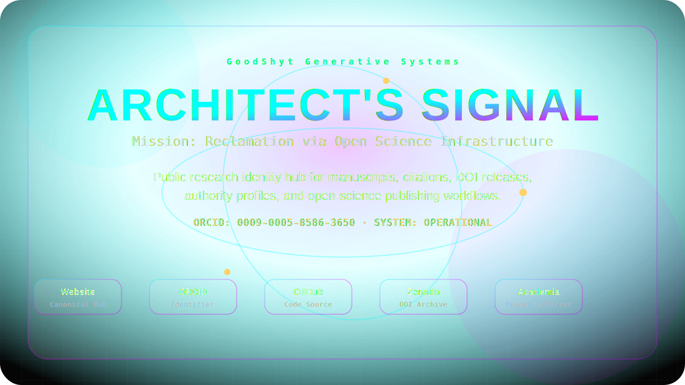

<!--
README generated from README.config.json.
Edit the config, then run: npm run readme:build
-->

<p align="center">
  
</p>

<p align="center">
  <a href="https://deontewatts.space"></a>
  <a href="https://orcid.org/0009-0005-8586-3650"></a>
  
</p>
## Support my work

You can support me via any of the links below:

[](https://www.patreon.com/cw/GetitD)
[](https://opencollective.com/deontewattsv1)
[](https://ko-fi.com/deontewattsv1)
[](https://sonarcloud.io/organizations/deontewattsv1/)
[](https://crowdfunding.lfx.linuxfoundation.org/deontewattssV1)
[](https://liberapay.com/DeontewattsV1/)
[](https://issuehunt.io/profiles/deontewattsv1)
[](https://polar.sh/dashboard/deonte-watts)
[](https://buymeacoffee.com/deontewattsv1)
[](https://thanks.dev/e/gh/deontewattsv1)
# ARCHITECT'S SIGNAL

**Deonte Watts** · Independent Researcher  
Mission: Reclamation via Open Science Infrastructure

A public research identity hub for manuscripts, citation records, DOI releases, authority profiles, and open-science publishing workflows. Architecting justice engines through code and community-centered design.

## Network Nodes

- [**DeonteWatts.Space**](https://deontewatts.space) — Canonical Hub
- [**ORCID**](https://orcid.org/0009-0005-8586-3650) — Research Identifier
- [**GitHub**](https://github.com/DeontewattsV1) — Code Source
- [**Zenodo**](https://zenodo.org/deontewatts) — DOI Archive
- [**Academia.edu**](https://deontewatts.academia.edu) — Research Mirror
- [**FAIRsharing**](https://fairsharing.org/users/17334) — Standards Profile

## Archival Protocol

| Step | Protocol | Function |
|---:|---|---|
| 01 | **AUTHOR** | Write in manuscript/main.tex and keep bibliography in bibliography/references.bib. |
| 02 | **RELEASE** | Create a GitHub release with a semantic version tag such as v1.0.0. |
| 03 | **ARCHIVE** | Zenodo ingests the enabled GitHub release and creates a DOI. |
| 04 | **SYNC** | DataCite receives DOI metadata with ORCID creator metadata. |
| 05 | **MIRROR** | Mirror DOI links to Academia.edu, alphaXiv, Zotero, and profile pages. |
| 06 | **PROMOTE** | Cloudflare Pages rebuilds the public research hub from GitHub. |

## Run the Research Hub App

```bash
npm install
npm run dev
npm run build
```

Cloudflare Pages build settings:

```txt
Build command: npm run build
Build output directory: dist
```

## Configure This README Front Page

Edit `README.config.json`, then regenerate the front page:

```bash
npm run readme:build
```

The generated README uses GitHub-safe Markdown plus an animated SVG image. Full browser JavaScript, mouse tilt effects, and arbitrary CSS should stay inside the Vite/Cloudflare website app, not inside `README.md`.

## Repository Map

```txt
assets/readme-hero.svg        README visual front-page header
README.config.json            Editable content/theme/profile config
scripts/generate-readme.mjs   README + SVG renderer
src/                          Vite/React public research hub app
data/                         Profile, publications, and workflow data
metadata/                     DOI, ORCID, Dublin Core, and DataCite records
manuscript/                   LaTeX manuscript sources
bibliography/                 BibTeX, RIS, and CSL citation records
```

## Citation

See `CITATION.cff` and `.zenodo.json`.
